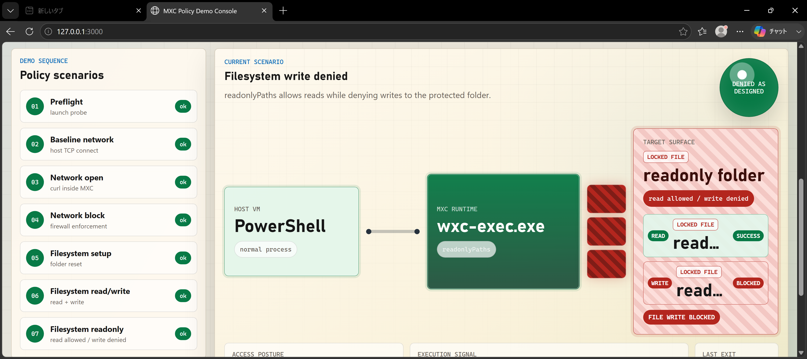

# MXC Windows Build & Policy Demo Scripts

<p align="left">
  
  
  
  
  
</p>

<p>
  <a href="#クイックスタート"></a>
  <a href="#mxc-をビルドする"></a>
  <a href="#ポリシーデモを実行する"></a>
  <a href="#トラブルシューティング"></a>
</p>

Windows 環境で [Microsoft MXC](https://github.com/microsoft/mxc) をできるだけシンプルにビルドし、MXC の基本的なポリシー動作を確認するための補助スクリプト集です。

英語版は [README-en.md](README-en.md) を参照してください。

## このリポジトリに含まれるもの

| パス                    | 役割                                                                                                                 |
| ----------------------- | -------------------------------------------------------------------------------------------------------------------- |
| `build_mxc_windows.ps1` | MXC リポジトリを clone し、Windows x64 向けに `wxc-exec.exe` をビルドします。                                        |
| `run_mxc_demo.ps1`      | ビルド済みの `wxc-exec.exe` とサンプルプロファイルを使い、ネットワークとファイルシステムのポリシー動作をデモします。 |
| `mxc-profiles\*.json`   | デモ用の MXC プロファイルです。ネットワーク許可・遮断、ファイル読み書き・読み取り専用を扱います。                    |

このリポジトリ自体には MXC のソースコードは含まれていません。既定では `build_mxc_windows.ps1` が `https://github.com/microsoft/mxc.git` を `C:\mxc-demo\mxc` に shallow clone します。

## 前提条件

### 実行環境

- Windows x64 環境
- PowerShell 5.1 以上、または PowerShell 7 以上
- インターネット接続
  - MXC リポジトリの clone
  - Rustup のダウンロード
  - Rust toolchain の取得
  - MXC ビルド中の依存関係取得
  - ネットワークデモでの `www.msftconnecttest.com:80` への接続確認
- できれば使い捨ての Windows VM
  - デモは `C:\mxc-demo` と `C:\mxc-demo-fs` を既定の作業場所として使います。
  - ネットワーク遮断デモは Windows Firewall enforcement を使うため、ゲスト VM 内の管理者 PowerShell での実行を推奨します。

### 必須ツール

`build_mxc_windows.ps1` は以下を確認または利用します。

| ツール                      | 要件                                                      | 補足                                                                             |
| --------------------------- | --------------------------------------------------------- | -------------------------------------------------------------------------------- |
| Git for Windows             | `git` が PATH から実行できること                          | MXC リポジトリを clone するために必要です。                                      |
| Node.js                     | 18 以上                                                   | `node` と `npm` が PATH から実行できる必要があります。                           |
| Visual Studio / Build Tools | C++ x64 tools を含むこと                                  | `vcvars64.bat` を自動検出します。検出できない場合は `-VcVarsPath` で指定します。 |
| Rust / Rustup               | 既定ではスクリプトが隔離ディレクトリに Rust `1.93` を導入 | `-SkipRustInstall` を使う場合は `rustc` と `cargo` を PATH に用意してください。  |

Visual Studio は、Visual Studio 2022 または Build Tools for Visual Studio 2022 で、少なくとも次のコンポーネントを入れておくことを推奨します。

- Desktop development with C++
- MSVC x64/x86 build tools
- Windows SDK
- C++ CMake tools for Windows

### デモ実行時に追加で意識すること

- `run_mxc_demo.ps1` は `C:\mxc-demo\mxc\sdk\bin\x64\wxc-exec.exe` を既定で探します。別の場所に MXC を置いた場合は `-RepoPath` を指定してください。
- `wxc-exec.exe` の起動時に DLL 不足のエラーが出る場合は、Visual Studio の C++ workload、MSVC x64 tools、Windows SDK、VC++ Redistributable x64、または MXC のビルド出力配置を確認してください。
- Python が WindowsApps alias を指している環境では、MXC 側の一部サンプルや確認作業で実体のある `python.exe` が必要になることがあります。
- PowerShell の実行ポリシーでスクリプトがブロックされる場合は、現在のプロセスだけ緩和して実行できます。

```powershell
Set-ExecutionPolicy -Scope Process -ExecutionPolicy Bypass
```

## クイックスタート

管理者 PowerShell を開き、このリポジトリのディレクトリで実行します。

```powershell
.\build_mxc_windows.ps1
.\run_mxc_demo.ps1
```

既定では次の動作になります。

1. `C:\mxc-demo` を作業ディレクトリとして作成します。
2. `C:\mxc-demo\mxc` に MXC を clone します。
3. `C:\mxc-demo\.rustup` と `C:\mxc-demo\.cargo-home` に Rust toolchain を隔離して導入します。
4. `build.bat --release --x64` を実行します。
5. `C:\mxc-demo\mxc\sdk\bin\x64\wxc-exec.exe` の存在を確認します。
6. デモ用 MXC プロファイルを順に実行します。

## MXC をビルドする

通常は既定値のままで実行できます。

```powershell
.\build_mxc_windows.ps1
```

よく使うオプションは次のとおりです。

| オプション           | 既定値                                 | 説明                                                              |
| -------------------- | -------------------------------------- | ----------------------------------------------------------------- |
| `-Workspace`         | `C:\mxc-demo`                          | MXC clone、Rust、npm cache を置く作業ディレクトリです。           |
| `-RepoUrl`           | `https://github.com/microsoft/mxc.git` | clone する MXC リポジトリです。                                   |
| `-RepoDirectoryName` | `mxc`                                  | `-Workspace` 配下に作る MXC ディレクトリ名です。                  |
| `-RustToolchain`     | `1.93`                                 | 導入または確認する Rust toolchain です。                          |
| `-Configuration`     | `release`                              | `release` または `debug` を指定します。                           |
| `-Platform`          | `x64`                                  | 現在は `x64` のみです。                                           |
| `-VcVarsPath`        | 自動検出                               | `vcvars64.bat` を明示指定します。                                 |
| `-ForceClone`        | 無効                                   | 既存の MXC clone を削除して clone し直します。                    |
| `-SkipRustInstall`   | 無効                                   | Rust の導入をスキップし、PATH 上の `rustc` / `cargo` を使います。 |
| `-SkipBuild`         | 無効                                   | clone や前提確認だけ行い、MXC ビルドをスキップします。            |
| `-RunProbe`          | 無効                                   | ビルド後に `wxc-exec.exe --probe` を実行します。                  |

例:

```powershell
.\build_mxc_windows.ps1 `
  -Workspace C:\work\mxc-demo `
  -Configuration debug `
  -VcVarsPath "C:\Program Files\Microsoft Visual Studio\2022\Community\VC\Auxiliary\Build\vcvars64.bat"
```

## ポリシーデモを実行する

ビルド完了後、次を実行します。

```powershell
.\run_mxc_demo.ps1
```

デモは以下を確認します。

| デモ                          | プロファイル                                       | 確認すること                                                                                             |
| ----------------------------- | -------------------------------------------------- | -------------------------------------------------------------------------------------------------------- |
| Baseline network check        | なし                                               | MXC の外側で VM から `www.msftconnecttest.com:80` に接続できること。                                     |
| Network open profile          | `mxc-profiles\network-open-microsoft.json`         | `internetClient` capability により、MXC 内の `curl.exe` が HTTP HEAD を取得できること。                  |
| Network block profile         | `mxc-profiles\network-block-microsoft.json`        | `network.defaultPolicy=block` と `enforcementMode=firewall` により、MXC 内からの外部接続が失敗すること。 |
| Filesystem read/write profile | `mxc-profiles\filesystem-readwrite-allowed.json`   | `C:\mxc-demo-fs\allowed` 配下の読み取りと書き込みが成功すること。                                        |
| Filesystem readonly profile   | `mxc-profiles\filesystem-readonly-deny-write.json` | `C:\mxc-demo-fs\readonly` は読めるが書き込めないこと。                                                   |

よく使うオプションは次のとおりです。

| オプション            | 既定値            | 説明                                                  |
| --------------------- | ----------------- | ----------------------------------------------------- |
| `-RepoPath`           | `C:\mxc-demo\mxc` | ビルド済み MXC リポジトリのパスです。                 |
| `-ConfigDirectory`    | `.\mxc-profiles`  | デモ用 JSON プロファイルのディレクトリです。          |
| `-VcVarsPath`         | 自動検出          | `vcvars64.bat` を明示指定します。                     |
| `-SkipNetworkBlock`   | 無効              | Firewall を使うネットワーク遮断デモをスキップします。 |
| `-SkipFilesystemDemo` | 無効              | ファイルシステムポリシーデモをスキップします。        |

管理者権限が使えない環境では、まずネットワーク遮断デモをスキップして動作確認できます。

```powershell
.\run_mxc_demo.ps1 -SkipNetworkBlock
```

## ブラウザデモコンソールを使う

`run_mxc_demo.ps1` と同じ MXC プロファイルを、ローカルホストの HTML/CSS/JavaScript UI からステップ実行できます。CLI のログを見せながら、ネットワーク許可・遮断、ファイル読み書き・読み取り専用の違いをデモカードとステータス表示で確認できます。

```powershell
npm start
```

起動後、ブラウザで `http://127.0.0.1:3000` を開きます。既定では `C:\mxc-demo\mxc` にある `wxc-exec.exe` と、このリポジトリの `mxc-profiles` を使います。別の場所に MXC を置いた場合は、画面上部の `RepoPath` を変更してください。

実行時イメージ:



ブラウザデモコンソールでは次の操作ができます。

| 操作            | 説明                                                                         |
| --------------- | ---------------------------------------------------------------------------- |
| `Status`        | `wxc-exec.exe`、`vcvars64.bat`、管理者権限、プロファイルの存在を確認します。 |
| `Run safe flow` | 管理者権限が必要な network block を除き、安全な順番でデモを実行します。      |
| `Run step`      | 各デモを 1 つずつ実行し、PowerShell / MXC の出力をリアルタイム表示します。   |

network block デモは Windows Firewall enforcement を使うため、Node サーバーを管理者 PowerShell から起動することを推奨します。

## トラブルシューティング

### `vcvars64.bat` が見つからない

Visual Studio Installer で C++ x64 tools が入っているか確認してください。自動検出できない場合は `-VcVarsPath` で指定します。

```powershell
.\build_mxc_windows.ps1 -VcVarsPath "C:\Program Files\Microsoft Visual Studio\2022\Community\VC\Auxiliary\Build\vcvars64.bat"
```

### `Node.js 18 以上が必要です` と表示される

Node.js 18 以上をインストールし、`node` と `npm` が PATH から実行できるようにしてください。

```powershell
node --version
npm --version
```

### `wxc-exec.exe` が見つからない

先にビルドを完了してください。既定の出力確認パスは次です。

```text
C:\mxc-demo\mxc\sdk\bin\x64\wxc-exec.exe
```

別の作業ディレクトリを使った場合は、デモ実行時に `-RepoPath` を指定します。

```powershell
.\run_mxc_demo.ps1 -RepoPath C:\work\mxc-demo\mxc
```

### ネットワーク遮断デモが期待どおりに失敗しない

`network-block-microsoft.json` は Windows Firewall enforcement を使います。ゲスト VM 内の管理者 PowerShell で実行してください。環境の Firewall、Proxy、セキュリティ製品、ネットワーク分離設定によって結果が変わる場合があります。

### Baseline network check が失敗する

MXC の外側で `www.msftconnecttest.com:80` に接続できていません。VM のネットワーク、Proxy、Firewall、DNS、社内ネットワーク制限を確認してください。

## ライセンス

このリポジトリのスクリプトとドキュメントは MIT License です。詳細は [LICENSE](LICENSE) を参照してください。
